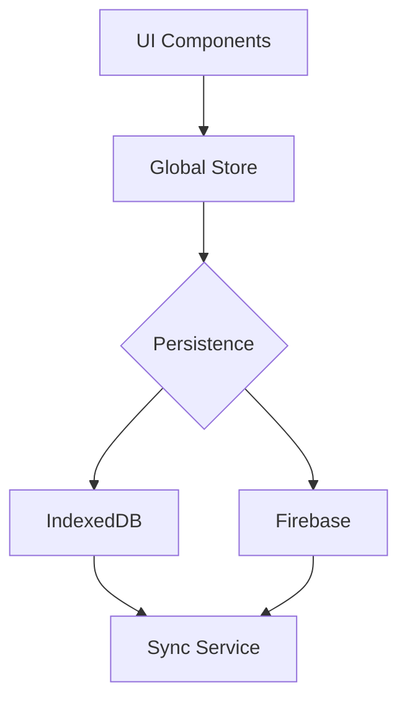

# Maptap

Enhanced Mobile Map CSV Editor for quickly editing and previewing geospatial data.

## 🚀 Project Overview

Maptap is a browser-based tool for visualizing, editing, and exporting geospatial point data (e.g., latitude/longitude) via CSV. It supports:

- Map view with live marker updates
- CSV import/export with validation
- Editable point metadata
- Integration with Firebase or local storage (if enabled)

## 🏗️ Architecture Overview

- **Frontend** – React and TypeScript components live in `src/components` with supporting hooks in `src/hooks`.
- **Backend** – Express server code is in `src/server.ts` with API routes under `src/routes`.
- **src/** – Main TypeScript application (React components, hooks, utilities).
- **public/** – Legacy JavaScript version kept for reference and quick demos.

## 🔄 Data Flow

Maptap follows a straightforward data pipeline:

1. **UI components** dispatch actions to the global store.
2. **Global store** updates application state and triggers persistence.
3. **Persistence** writes to **IndexedDB** or **Firebase** depending on configuration.
4. **Sync service** listens for changes and keeps data synchronized.

> Firebase integration is optional; see [ticket MP-6](tickets/MP-6-doc-readme-update.md) for environment variables.



## 📦 Installing Dependencies

Use [pnpm](https://pnpm.io/) for dependency management:

```bash
pnpm install
```

### Quick Setup

```bash
pnpm lint
pnpm test
pnpm dev
```

Run `pnpm lint` to check formatting and `pnpm test` to execute the Jest suite before starting the development server.

## 🧹 Linting

Run ESLint to check code quality:

```bash
pnpm lint
```

## 🏃‍♂️ Running Maptap

Start the development server:

```bash
pnpm dev
```

Use `--` to pass Node flags to the underlying `ts-node` process. For example:

```bash
pnpm dev -- --inspect
```

Set the `PORT` environment variable to change the listening port.

Open [http://localhost:3000](http://localhost:3000) in your browser to view the app.

To build and run for production:

```bash
pnpm build
pnpm start
```

The compiled JavaScript will be written to `public/build`.

## 🧪 Running Tests

Run the test suite with:

```bash
pnpm test
```

Use `pnpm test:watch` while developing to re-run tests on file changes.

## 📥 Importing and Exporting Data

### Step-by-Step CSV Workflow

1. Click **Import** and choose a CSV file to load your points.
2. Edit point data by dragging markers on the map or updating values in the table.
3. Click **Export CSV** to download the updated dataset.

- GeoJSON files can also be imported through the same dialog.

### Example CSV

```csv
id,name,lat,lng
1,Site A,48.2,-122.3
2,Site B,47.8,-122.5
```

### Example GeoJSON

```json
{
  "type": "FeatureCollection",
  "features": [
    {
      "type": "Feature",
      "geometry": { "type": "Point", "coordinates": [-122.3, 48.2] },
      "properties": { "id": 1, "name": "Site A" }
    }
  ]
}
```

## 🗺️ Map Interaction

- Click on the map to add a new point.
- Drag existing markers to update their coordinates.

## 🔌 Running the Backend Server

Start the API server (useful for production builds):

```bash
pnpm start
```

Set `PORT` in your environment to change the listening port.

## ⚙️ Environment Configuration

Optional environment variables can be placed in a `.env` file. The app falls back to local storage when Firebase values are not present:

```bash
FIREBASE_API_KEY=your-api-key
FIREBASE_AUTH_DOMAIN=your-project.firebaseapp.com
FIREBASE_PROJECT_ID=your-project-id
FIREBASE_STORAGE_BUCKET=your-project-id.appspot.com
FIREBASE_APP_ID=your-firebase-app-id
PORT=3000 # override default port
DATA_STORE=file # use the file-based data store
```

These variables are loaded at runtime if present.
